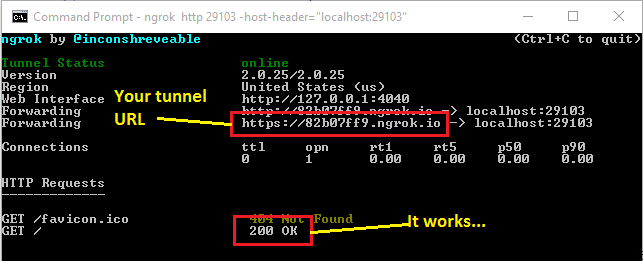
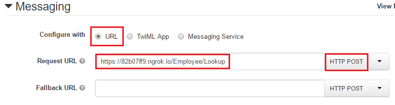

# SMS/MMS Employee Directory on ASP.NET MVC

[](https://ci.appveyor.com/project/TwilioDevEd/server-notifications-csharp) *TODO: CI*

Use Twilio to accept SMS messages and turn them into queries against an SQL database. This example functions as an Employee Directory where a mobile phone user can send a text message with a partial string of the person's name and it will return their picture and contact information (Email address and Phone number).

[Read the full tutorial here](https://www.twilio.com/docs/tutorials/walkthrough/server-notifications/csharp/mvc)! *TODO: Tutorial coming soon*

## Trying it Out

### Prerequisites

1. A Twilio account with a provisioned phone number. (Get a [free account](https://www.twilio.com/login?utm_campaign=tutorials&utm_medium=readme) here.)
2. Visual Studio 2015 or 2013. (Download the [free Community edition](https://www.visualstudio.com/en-us/downloads/download-visual-studio-vs.aspx) here.)
   - Visual Studio *Code* will not work.

### Clone and Test

1. First clone this repository which you can do from [within Visual Studio](https://visualstudio.github.com/), using [GitHub Desktop](https://desktop.github.com/), or from the command line:
   ```
   git clone https://github.com/TwilioDevEd/employee-directory-csharp.git
   ```

2. Open the `EmployeeDirectory.sln` using Visual Studio and run it.

3. The first time the ASP.NET MVC application loads, Entity Framework will create a new SQLite database in the App_Data folder named `Employees.sqlite` seeded with data from the `seed-data.json` file. (Data provided by Marvel. &copy; 2016 MARVEL)

4. The `HomeController`'s `Index` action will load by default. It simply queries the database for the first employee to ensure everything is setup.

5. The `Home/Index.cshtml` view displays the first employee found as well as providing a search box to test the employee directory search by name functionality. Type in a name, or partial name, and click the Go button. The Twilio Markup XML response (TwiML) will be returned. (Hint: The database has been seeded with Marvel Universe "employees".)

6. At this point you have the application working. You will notice that the XML response is coming from the `/Employee/Lookup` route. You will need this in the next section to setup your Twilio web hook.

### Connect to Twilio

1. You need to connect Twilio to your new `/Employee/Lookup` service. To do this, you need to make your local IIS Express development web server accessible to Twilio. The easiest way to do this is to use [ngrok](https://www.twilio.com/blog/2015/09/6-awesome-reasons-to-use-ngrok-when-testing-webhooks.html?utm_campaign=tutorials&utm_medium=readme). Once you've downloaded and unzipped ngrok, create your tunnel like so:
   ```
   ngrok http 29103 -host-header="localhost:29103"
   ```

2. Test the URL `https://*your-ngrog-subdomain*.ngrok.io/` to make sure the tunnel is working correctly. (Be sure your solution in Visual Studio is running.)
   

3. [Login](https://www.twilio.com/login?utm_campaign=tutorials&utm_medium=readme) to your Twilio account (or [create one](https://www.twilio.com/try-twilio?utm_campaign=tutorials&utm_medium=readme) if you don't yet have one) and select (or create) a [phone number](https://www.twilio.com/user/account/phone-numbers/incoming?utm_campaign=tutorials&utm_medium=readme).

4. Scroll down to the **Messaging** section and set the **Request URL** to: `https://*your-ngrog-subdomain*.ngrok.io/Employee/Lookup` and Save.
   

5. Send a text to your phone number. Twilio will receive your message and forward it to the web hook you configured in the previous step. Your web hook returns the XML response, which Twilio will in turn send back the result message to your phone. Employee directory with no apps or internet access required.

### Getting Ready for Production

1. Out of the box, this example uses a SQLite database. Depending on your use case, this may be fine, but many will want to move up to SQL Server. To do this, simply edit the `DefaultConnection` connection string to point to a SQL Server. Entity Framework will automatically create the database and schema, along with seeding the database with the Marvel sample data.

2. You will likely want to change the App_Data/seed-data.json file, or simply delete it. If the file does not exist, the application will simply initialize an empty database.

3. Create an ETL job or other background service that copies the employee contact information from your HR or other system into the SQL database for this application.

## Meta

* No warranty expressed or implied. Software is as is. Diggity.
* [MIT License](http://www.opensource.org/licenses/mit-license.html)
* Lovingly crafted by Twilio Developer Education.